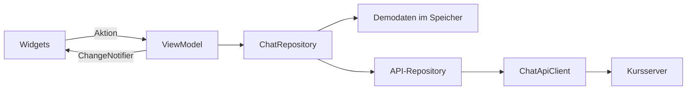

# MMA Chat · Flutter gemeinsam lernen

Eine vollständige Chat-App für den **MMA Code Club**: Räume anlegen, Nachrichten
schreiben, Inhalte bearbeiten und löschen. Dazu eine überschaubare Architektur,
verständliche Fehlerzustände und Tests, die ohne den Kursserver laufen.

Die App startet mit lokalen Beispieldaten. Mit einer Build-Konfiguration lässt
sie sich auf die im Unterricht verwendete HTTP-API umstellen.

## In drei Schritten starten

Voraussetzungen: [Flutter installieren](https://docs.flutter.dev/install/quick),
Chrome für den Web-Einstieg und ein Editor, etwa VS Code mit Flutter-Erweiterung.

```sh
git clone https://github.com/MMACodeClub/2026_HS_Major_Flutter.git
cd 2026_HS_Major_Flutter
flutter doctor
flutter pub get
flutter run -d chrome
```

Für den ersten Start sind kein Konto, kein API-Schlüssel und kein eigener Server
nötig. Der Demomodus speichert Daten nur im Arbeitsspeicher. Hot Reload erhält sie;
Hot Restart oder ein Neuladen der Browserseite setzt sie zurück.

Die Projektbasis ist **Flutter 3.35.4 / Dart 3.9.2** (lokal verwendetes SDK).
Das Projekt verlangt mindestens diese Version und nutzt auch 2026 gültige APIs.
Neue SDK-Versionen vor einem gemeinsamen Kursstart lokal prüfen.
`pubspec.lock` ist für reproduzierbare Abhängigkeiten eingecheckt; Flutter SDK,
Pakete und Build-Dateien werden auf dem eigenen Rechner erzeugt beziehungsweise geladen.

## Was die App kann

- Räume durchsuchen, erstellen, umbenennen und mit Bestätigung löschen.
- Nachrichten laden, senden, bearbeiten und mit Bestätigung löschen.
- Fehler anzeigen, erneut laden und fehlgeschlagene Entwürfe behalten.
- Leere Listen und laufende Anfragen verständlich darstellen.
- Helles und dunkles Material-3-Theme nach Systemeinstellung.
- Deutsche Oberfläche und Datums-/Zeitdarstellung für die Schweiz.
- Web, Android, iOS und macOS als angelegte Zielplattformen.

Neue Nachrichten anderer Personen erscheinen nach **Aktualisieren** oder
Pull-to-refresh. Die HTTP-API wird nicht automatisch abgefragt; Echtzeit-Updates
sind eine separate Übungsaufgabe.

## Einmal durch den Code

```text
lib/
  main.dart                     Konfiguration und Abhängigkeiten zusammensetzen
  app.dart                      MaterialApp, Sprache, Theme und Lebensdauer
  config/                       Demo/API über Dart-Defines wählen
  domain/                       Unveränderliche Modelle und Eingabevalidierung
  data/
    chat_repository.dart        Gemeinsame Schnittstelle
    repositories/               Demo- und API-Implementierung
    services/                   HTTP, JSON, Statuscodes und Zeitlimit
  ui/
    core/                      Gemeinsame Zustandslogik, Dialoge und Theme
    rooms/                     Raumliste + RoomsViewModel
    messages/                  Nachrichtenansicht + MessagesViewModel
```



`ChangeNotifier` und `ListenableBuilder` gehören zu Flutter. Abhängigkeiten werden
über Konstruktoren übergeben. Für zwei Bildschirme genügt `Navigator`; die kleine
App braucht keine zusätzliche Zustandsbibliothek oder Codegenerierung.

Weiterlesen: [Architektur und Entscheidungen](docs/ARCHITEKTUR.md),
[Lernpfad mit Übungen](docs/LERNPFAD.md), [API-Vertrag](docs/API.md).

## Kurs-API verwenden

```sh
flutter run -d chrome --dart-define=DATA_SOURCE=api --dart-define=API_BASE_URL=https://mmp.li
```

Die Basisadresse enthält noch **kein** `/chats`. Für einen eigenen Server ist
auch ein Präfix wie `https://example.org/api` möglich. Die App ergänzt und
kodiert die einzelnen Pfadsegmente. HTTPS ist erforderlich; HTTP ist nur für
lokale Entwicklung mit `localhost`, `127.0.0.1` oder `::1` zugelassen.

Die bekannte Kurs-API verwendet `roomId` als Raumnamen und `_id` als technische
ID. `randomName` ist ein Anzeigename, keine verifizierte Identität. Das Beispiel
enthält bewusst keine erfundene Anmeldung oder simulierte Benutzerrechte:
Die API muss Zugriffsregeln serverseitig umsetzen. Für einen öffentlichen
Produktivchat fehlen unter anderem Authentifizierung, Autorisierung,
Moderation, Persistenz im Demomodus und Echtzeitübertragung.

Im API-Modus wirken Änderungen auf den konfigurierten Server. Für Unterricht und
Tests eigene Übungsräume verwenden. Alle automatisierten Tests verwenden
lokale Daten oder einen HTTP-Mock und verändern den Kursserver nicht.
Dart-Defines sind im App-Build lesbar und eignen sich **nicht für Geheimnisse**.

## Andere Zielplattformen

```sh
flutter devices
flutter run -d macos
# Android-Gerät oder iOS-Simulator aus flutter devices auswählen:
flutter run -d <device-id>
```

Android benötigt das Android SDK; iOS und macOS benötigen Xcode auf einem Mac.
Internet-Berechtigung für Android und Netzwerk-Client-Entitlements für macOS
sind bereits gesetzt, auch für Release-Builds. Im Web muss der Server CORS für
den Ursprung der App und die verwendeten Methoden erlauben.

Die native Projektstruktur ist enthalten. Native Builds, Gerätesignierung und
App-Store-Veröffentlichung müssen in der jeweiligen Zielumgebung geprüft werden.

## Qualität prüfen

```sh
dart format --output=none --set-exit-if-changed lib test
flutter analyze
flutter test --coverage
flutter build web --release
```

Die Tests decken JSON-Validierung, HTTP-Vertrag, Fehlermeldungen, CRUD,
Lebenszyklus, doppelte Aktionen, verlorene Netzwerkverbindungen und die
wichtigsten Bedienabläufe ab. Ein Widget-Test prüft zusätzlich eine schmale
Ansicht mit vergrösserter Schrift.

Diese Prüfungen werden bei Bedarf lokal ausgeführt. Auf GitHub laufen keine
Actions, Builds oder Deployments.

## Gemeinsam weiterbauen

Bitte [CONTRIBUTING.md](CONTRIBUTING.md) lesen. Kleine Änderungen auf einem
Branch umsetzen, Tests ergänzen und im Pull Request erklären, was sich für die
Nutzenden verbessert. Für die Zuordnung zur Präsentation hilft der Lernpfad.

Lizenz: [MIT](LICENSE). Erstellt als Lehrprojekt für MMACodeClub, Herbstsemester 2026.
